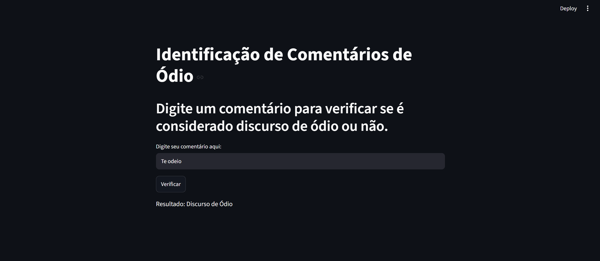
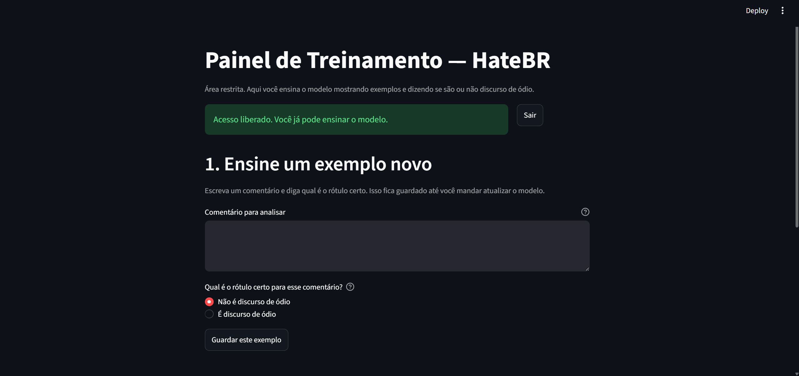
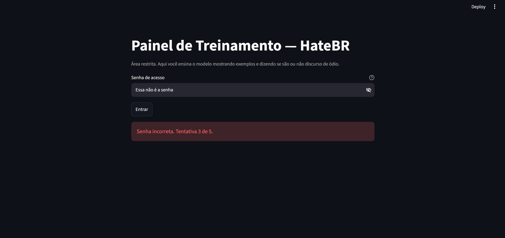

# IA para Discurso de Ódio


> **EN:** A Portuguese hate-speech classifier (TF-IDF + Logistic Regression) with a public prediction page and a password-protected panel where I can teach it new examples, which it uses to retrain itself. Full details below are in Portuguese, the project's language.

Uma IA em treinamento pra detectar se uma frase é discurso de ódio ou não. A ideia é simples: eu mostro exemplos pra ela, digo se é ódio ou não, e ela vai aprendendo com isso. Só eu tenho acesso a esse treinamento, pra não deixar qualquer um ensinando errado pro modelo.

Modelo atual: TF-IDF + Regressão Logística, validado com 5-fold cross-validation. F1 macro ~0,75 no dataset combinado (HateBR + ToLD-BR).


## Antes de rodar

Esse repositório tem só o código. Não subi dataset, modelo treinado nem os rótulos que eu fui dando (tá tudo no `.gitignore`), datasets acadêmicos têm licença própria, e os rótulos são coisa minha mesmo.

Pra rodar do zero:

1. `pip install -r requirements.txt`
2. Baixa o [HateBR](https://github.com/franciellevargas/HateBR) e o [ToLD-BR](https://github.com/JAugusto97/ToLD-Br) (cada um com sua licença, dá uma lida antes) e joga em `HateBR-7.0.0/dataset/HateBR.csv` e `HateBR-7.0.0/dataset/ToLD-BR.csv`.
3. Roda `python retreinar_modelo.py` uma vez pra gerar o `modelo_logistic_regression.pkl` e o `vetorizador.pkl`.

## As duas telas

**`classificador.py`** é a parte pública: qualquer um digita um comentário e vê o que o modelo acha.
```
python -m streamlit run classificador.py
```


**`painel_treino.py`** é onde eu ensino o modelo. Fica atrás de senha porque só eu devo mexer nisso.

Primeiro, gera o hash da sua senha (a senha em si nunca fica salva em lugar nenhum):
```
python gerar_hash_senha.py
```
Copia o hash que aparecer e define a variável de ambiente:
```
setx HATEBR_SENHA_HASH "cole_o_hash_aqui"
```
(fecha e abre o terminal de novo pra pegar a variável, aí roda)
```
python -m streamlit run painel_treino.py
```
Lá dentro: escrevo um comentário, escolho se é ódio ou não, clico em "Guardar este exemplo". Vou fazendo isso quantas vezes quiser e, quando achar que já deu, clico em "Atualizar modelo agora", ele retreina com tudo que eu ensinei até ali.



Também tem o `retreinar.bat`, um atalho de duplo clique que roda o retreino e guarda o log.

## Segurança do painel de treino

- Senha nunca fica salva em texto puro, só o hash SHA-256 dela (variável `HATEBR_SENHA_HASH`).
- Comparação de senha usa `hmac.compare_digest`, resistente a timing attack.
- Depois de 5 tentativas erradas, a página bloqueia login até recarregar.
- Servidor Streamlit escuta só em `127.0.0.1` por padrão (`.streamlit/config.toml`), não expõe a porta pra rede sem eu configurar isso explicitamente.

Isso é suficiente pra uso pessoal local. Se algum dia eu hospedar isso num servidor público, preciso somar HTTPS na frente.



## O resto do código (não roda sozinho, é usado pelos dois de cima)

- `dados_treino.py`, junta o HateBR com o ToLD-BR e, se eu já tiver ensinado alguma coisa, soma os meus exemplos também.
- `retreinar_modelo.py`, treina do zero com validação cruzada. Só troca o modelo salvo se o novo for melhor.
- `testar_modelo.py`, teste rápido, só pra conferir que os `.pkl` não estão corrompidos.
- `test_dados_treino.py`, checagem automática de que os dados estão carregando certo.
- `gerar_hash_senha.py`, gera o hash da senha do painel de treino, sem nunca salvar a senha em si.

## O que fica de fora do repositório (gerado na hora, não mexe à mão)

- `modelo_logistic_regression.pkl` e `vetorizador.pkl`, o modelo treinado e o que converte texto em número pra ele entender.
- `best_score.json`, guarda a melhor nota já alcançada, pra saber se vale a pena trocar o modelo.
- `feedback_treino.csv`, todos os exemplos que eu já ensinei.
- `historico_execucoes.log`, log de cada retreino.
- `HateBR-7.0.0/`, os datasets originais.

## Colocar no ar

Pra deixar `classificador.py` acessível pra qualquer um testar (sem o painel de treino, esse fica só local mesmo):

1. Sobe esse repositório no GitHub (já feito).
2. Entra em [share.streamlit.io](https://share.streamlit.io), conecta sua conta GitHub.
3. Aponta pro repositório, escolhe `classificador.py` como arquivo principal.
4. Sobe o `modelo_logistic_regression.pkl` e o `vetorizador.pkl` como "Secrets"/arquivos do app, já que eles não estão no repositório (ver seção acima).

## Créditos

Modelo treinado com dois datasets acadêmicos de português:

```bibtex
@inproceedings{vargas-etal-2022-hatebr,
    title = "{H}ate{BR}: A Large Expert Annotated Corpus of {B}razilian {I}nstagram Comments for Offensive Language and Hate Speech Detection",
    author = "Vargas, Francielle and Carvalho, Isabelle and Rodrigues de Góes, Fabiana and Pardo, Thiago and Benevenuto, Fabrício",
    booktitle = "Proceedings of the 13th Conference on Language Resources and Evaluation (LREC 2022)",
    year = "2022",
    url = "https://aclanthology.org/2022.lrec-1.777",
}
```

```bibtex
@inproceedings{leite2020toldbr,
    title = "Toxic Language Detection in Social Media for {B}razilian {P}ortuguese: New Dataset and Multilingual Analysis",
    author = "Leite, João Augusto and Silva, Diego Furtado and Bontcheva, Kalina and Scarton, Carolina",
    booktitle = "Proceedings of the 1st Conference of the Asia-Pacific Chapter of the Association for Computational Linguistics and the 10th International Joint Conference on Natural Language Processing",
    year = "2020",
}
```

Licença do meu código: MIT (ver `LICENSE`). Os datasets têm licença própria dos autores, não redistribuídos aqui.
